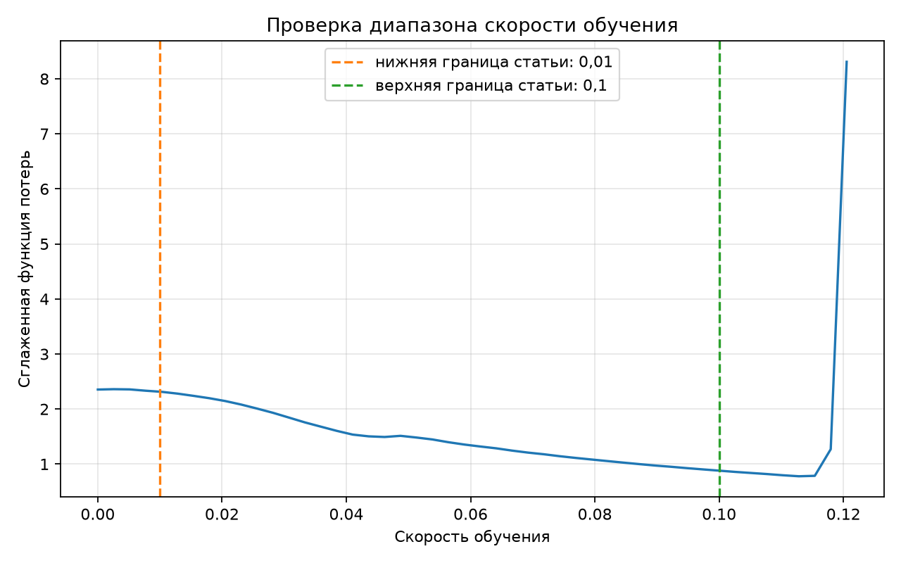
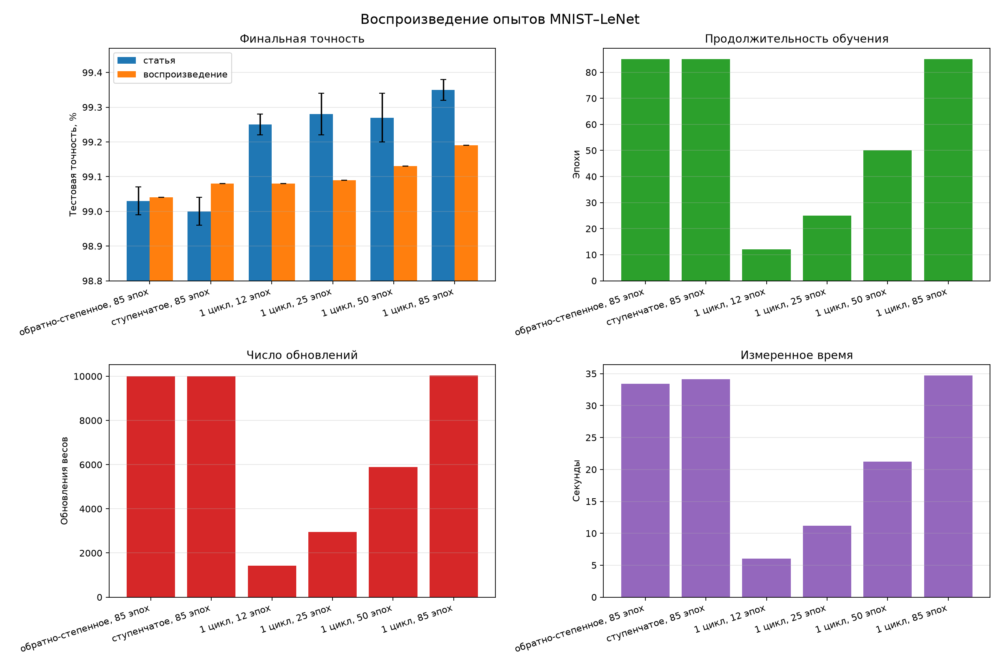
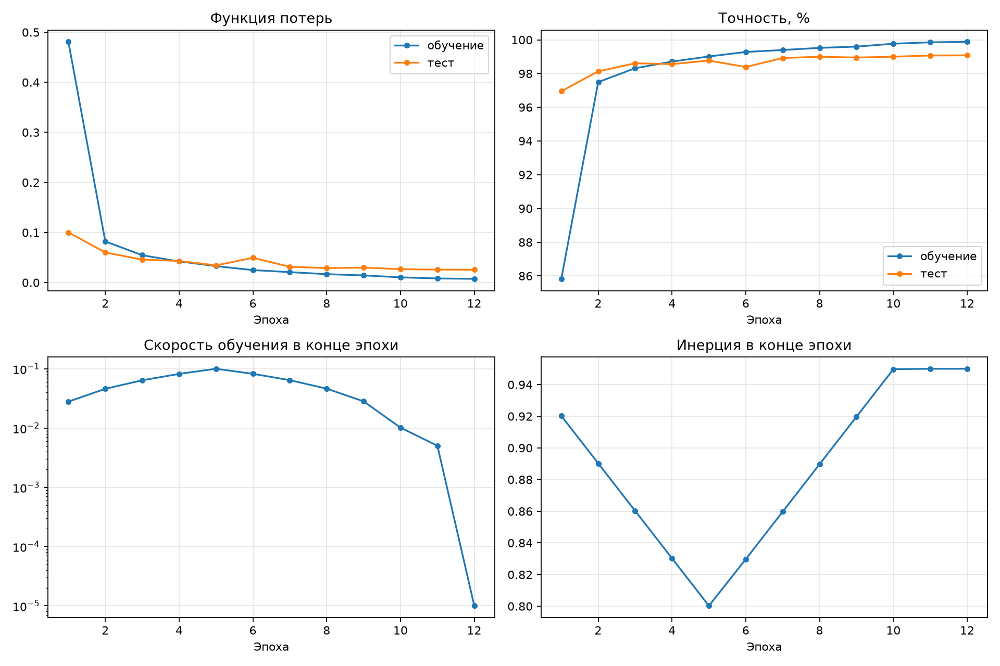

# Отчет о воспроизведении статьи Super-Convergence

## 1. Краткое содержание работы

В работе воспроизводится часть статьи Лесли Смита и Николая Топина «Super-Convergence: Very Fast Training of Neural Networks Using Large Learning Rates». Авторы статьи показали, что модель можно обучить значительно быстрее, если во время обучения варьировать скорость обучения. Такой режим получил название **1cycle**.

Для воспроизведения были выбраны шесть экспериментов из блока MNIST–LeNet таблицы 2 статьи. Сравнивались два обычных режима обучения и четыре режима `1cycle` разной продолжительности. Исходная реализация авторов выполнена в Caffe. В данной работе модель и обучение перенесены на PyTorch с сохранением архитектуры и основных гиперпараметров.

Основной результат воспроизведения - режим `1cycle` на 12 эпохах достиг финальной точности 99,08%, а обычное обучение на 85 эпохах - 99,04%. То есть сопоставимое качество получено примерно при 7-ми кратно меньшем числе обновлений весов и в 5,55 раза быстрее по времени. Повышение точности до 99,25%, указанное авторами в статье, повторить не удалось.

## 2. Цель и проверяемая гипотеза

Цель работы - проверить на практике основной эффект **Super-Convergence** на простой и доступной для воспроизведения задаче.

Проверяемая гипотеза сформулирована следующим образом:

> Политика `1cycle` позволяет обучить LeNet на MNIST за существенно меньшее число эпох и обновлений весов в сравнении с обычным обучением.

В качестве основного сравнения использовались:

- обычное (обратно-степенное) расписание на 85 эпохах;
- политика `1cycle` на 12 эпохах.

## 3. Основная идея статьи

### 3.1. Скорость обучения

Во время обучения веса сети изменяются методом **SGD**:

$$
w_{t+1} = w_t - \eta_t g_t
$$

Если параметр `Learning Rate` слишком мал, веса изменяются медленно и обучение занимает много времени. Если значение слишком велико, модель может перескакивать через подходящие решения, а функция потерь начинает расти.

Обычно обучение начинают с умеренного значения и постепенно уменьшают его. Авторы статьи предлагают другой подход: сначала увеличивать `Learning Rate` до необычно большого значения, затем уменьшать его, а в конце снижать почти до нуля.

### 3.2. Политика 1cycle

Полный режим `1cycle` состоит из трех частей:

1. `Learning Rate` линейно увеличивается от нижней границы до верхней.
2. Затем он линейно уменьшается обратно до начального значения.
3. На заключительном участке он уменьшается еще на несколько порядков.

Параметр **Momentum** изменяется в противоположную сторону:

- при росте `Learning Rate` значение `Momentum` уменьшается;
- при снижении `Learning Rate` значение `Momentum` увеличивается.

Такое сочетание позволяет сначала быстро исследовать пространство возможных весов, а затем аккуратно уточнить найденное решение.

### 3.3. Большая скорость как регуляризация

Авторы объясняют эффект тем, что большое значение `Learning Rate` действует как дополнительная регуляризация. Модель не может слишком рано закрепиться в узком решении, хорошо подходящем только обучающим данным. Большие шаги добавляют шум и заставляют искать более устойчивую область функции потерь.

Из этого следует важное практическое правило статьи - разные виды регуляризации должны быть сбалансированы. Если используется очень большой `Learning Rate`, иногда требуется уменьшить `Weight Decay` или отказаться от части других способов регуляризации.

## 4. Выбранная часть статьи

В таблице 2 статьи приведено шесть экспериментов с MNIST и LeNet:

| Режим статьи | Momentum | Эпохи | Точность статьи |
|---|---|---:|---:|
| `0.01/inv` | `0.9` | 85 | 99,03 ± 0,04% |
| `0.01/step` | `0.9` | 85 | 99,00 ± 0,04% |
| `0.01-0.1/5` | `0.95-0.8/5` | 12 | 99,25 ± 0,03% |
| `0.01-0.1/12` | `0.95-0.8/12` | 25 | 99,28 ± 0,06% |
| `0.01-0.1/23` | `0.95-0.8/23` | 50 | 99,27 ± 0,07% |
| `0.02-0.2/40` | `0.95-0.8/40` | 85 | 99,35 ± 0,03% |

где:
- `inv` - обратно-степенное уменьшение скорости;
- `step` - ступенчатое уменьшение;
- число после диапазона в строках `1cycle` задает продолжительность одного этапа основного цикла.

Этот блок выбран по следующим причинам:

- MNIST имеет небольшой размер и быстро загружается;
- LeNet содержит только 431 080 параметров;
- все опыты выполняются за несколько минут даже с повторными запусками;
- в статье приведены конкретные численные ориентиры;
- эксперимент непосредственно проверяет основное утверждение о сокращении обучения.

## 5. Экспериментальная установка

### 5.1. Данные и модель

MNIST содержит 60 000 обучающих и 10 000 тестовых изображений рукописных цифр. Каждое изображение имеет размер 28 × 28 пикселей и относится к одному из десяти классов.

Использована архитектура LeNet из официального примера Caffe:

1. Сверточный слой: 1 входной канал, 20 выходных каналов, ядро 5 × 5.
2. Максимальное объединение с окном 2 × 2.
3. Сверточный слой: 20 входных и 50 выходных каналов, ядро 5 × 5.
4. Максимальное объединение с окном 2 × 2.
5. Полносвязный слой из 800 входов и 500 выходов.
6. Функция активации ReLU.
7. Выходной слой на 10 классов.

Общее число обучаемых параметров - 431 080. Значения пикселей делятся на 256, как в исходном описании Caffe. Для весов используется инициализация Xavier, а для смещений - нулевая инициализация.

### 5.2. Общие параметры

Во всех шести режимах сохранены одинаковые условия:

| Параметр | Значение |
|---|---:|
| Размер пакета | 512 |
| Оптимизатор | SGD |
| Weight Decay | 0,0005 |
| Множитель Learning Rate для смещений | 2 |
| Функция потерь | перекрестная энтропия |
| Смешанная точность | выключена |
| Начальное случайное число | 42 |

Тестовая выборка используется только для оценки качества. Расширение обучающих данных не применяется.

### 5.3. Программное и аппаратное окружение

| Компонент | Значение |
|---|---|
| Операционная система | Manjaro Linux |
| Python | 3.14.7 |
| PyTorch | 2.13.0+cu129 |
| torchvision | 0.28.0+cu129 |
| CUDA в сборке PyTorch | 12.9 |
| cuDNN | 92000 |
| GPU | NVIDIA GeForce RTX 5070 Ti, 16 ГБ |

Авторы статьи использовали Caffe и другое оборудование. Поэтому абсолютное время напрямую со статьей не сравнивалось. Время используется только для сравнения режимов, выполненных в одинаковом локальном окружении.

## 6. Реализация расписаний

### 6.1. Обратно-степенное расписание

Для первого режима использована формула для `solver` (стандартный механизм обучения во фреймворке Caffe):

$$
\eta_t = 0{,}01\left(1 + 0{,}0001t\right)^{-0{,}75}
$$

Обучение ограничено 10 000 обновлений весов, что соответствует примерно 85 эпохам при размере пакета 512.

### 6.2. Ступенчатое расписание

В статье указано только обозначение `0.01/step`, но не приведены интервал и коэффициент уменьшения, поэтому при воспроизведении принято следующее допущение:

- первые 5000 шагов: `Learning Rate = 0,01`;
- следующие 5000 шагов: `Learning Rate = 0,001`;
- `Momentum = 0,9` на всем протяжении обучения.

### 6.3. Одноцикловые режимы

Продолжительность фаз определена по обозначениям таблицы статьи:

| Всего эпох | Рост | Снижение | Заключительная фаза | Диапазон Learning Rate |
|---:|---:|---:|---:|---|
| 12 | 5 | 5 | 2 | `0,01 → 0,1 → 0,01 → 0,00001` |
| 25 | 12 | 12 | 1 | `0,01 → 0,1 → 0,01 → 0,00001` |
| 50 | 23 | 23 | 4 | `0,01 → 0,1 → 0,01 → 0,00001` |
| 85 | 40 | 40 | 5 | `0,02 → 0,2 → 0,02 → 0,00002` |

Точное конечное значение `Learning Rate` для MNIST в статье не указано. В соответствии с текстом статьи оно выбрано в 1000 раз меньше начального. На заключительной фазе `Momentum` остается равным 0,95.

## 7. Проверка диапазона скорости обучения

Перед основными экспериментами выполнен **LR Range Test**. В ходе проверки планировалось линейно увеличить `learning rate` от 0,00001 до 0,3. Тест автоматически завершился при значении около 0,1205, когда функция потерь резко выросла. Поэтому на графике представлен фактически пройденный диапазон от 0,00001 до 0,1205. Полученный результат подтвердил, что используемая в статье верхняя граница `LR = 0,1` находится в области больших, но еще устойчивых значений.



Полученный график подтверждает, что верхняя граница 0,1 для первых трtх режимов `1cycle` выбрана разумно - она находится рядом с областью быстрого обучения, но ниже наблюдаемой границы расходимости.

## 8. Полученные результаты

В таблице используется финальная точность, поскольку именно финальный результат приведtн авторами статьи. Лучшая точность показана отдельно и не подменяет основной показатель.

| Режим | Эпохи | Обновления | Статья, % | Финальная, % | Лучшая, % | Время, с |
|---|---:|---:|---:|---:|---:|---:|
| обратно-степенное | 85 | 10 000 | 99,03 | 99,04 | 99,09 | 33,39 |
| ступенчатое | 85 | 10 000 | 99,00 | 99,08 | 99,11 | 34,13 |
| `1cycle`, 12 эпох | 12 | 1 416 | 99,25 | 99,08 | 99,08 | 6,01 |
| `1cycle`, 25 эпох | 25 | 2 950 | 99,28 | 99,09 | 99,13 | 11,17 |
| `1cycle`, 50 эпох | 50 | 5 900 | 99,27 | 99,13 | 99,18 | 21,22 |
| `1cycle`, 85 эпох | 85 | 10 030 | 99,35 | 99,19 | 99,21 | 34,70 |

Во всех опытах максимальная занятая память GPU составила около 216 МиБ. Различия между режимами связаны с продолжительностью обучения, а не с размером модели.



Кривые короткого режима показывают ожидаемое поведение `1cycle` - скорость сначала растtт, затем снижается, а `Momentum` изменяется в противоположном направлении.



## 9. Обсуждение результатов

### 9.1. Обычные режимы

Для обратно-степенного расписания получено 99,04% против 99,03 ± 0,04% в статье. Результат практически совпадает с опубликованным ориентиром.

Ступенчатый режим дал 99,08% против 99,00 ± 0,04%. Небольшое превышение может быть связано с выбранным интервалом ступени, который не раскрыт в статье, а также с отличиями PyTorch от Caffe.

После нескольких десятков эпох обучающая точность продолжает приближаться к 100%, а тестовая остаtтся около 99%. Это означает, что большая часть последующего обучения почти не улучшает способность модели.

### 9.2. Одноцикловые режимы

Все режимы `1cycle` достигли высокой точности. При увеличении продолжительности наблюдается последовательный рост финального результата:

```text
12 эпох → 99,08%
25 эпох → 99,09%
50 эпох → 99,13%
85 эпох → 99,19%
```

Опубликованные значения воспроизведены не полностью - полученные результаты ниже ориентиров статьи на 0,14–0,19 процентного пункта. На тестовой выборке из 10 000 изображений это соответствует примерно 14–19 дополнительным ошибкам.

Тем не менее главный эффект статьи продемонстрирован. Режим на 12 эпохах получил 99,08%, то есть не хуже двух обычных режимов, но использовал только 1416 обновлений весов.

По сравнению с обратно-степенным обучением:

- число эпох уменьшилось с 85 до 12 - в 7,08 раза;
- число обновлений уменьшилось с 10 000 до 1416 - в 7,06 раза;
- измеренное время уменьшилось с 33,39 до 6,01 секунды - в 5,55 раза;
- финальная точность выросла с 99,04% до 99,08%.

Разница между сокращением числа шагов и фактическим ускорением объясняется постоянными затратами на инициализацию, загрузку данных и проверку модели.

### 9.3. Причины отличий результата от статьи

Возможны следующие причины:

1. Исходный эксперимент выполнен в Caffe, а воспроизведение - в PyTorch.
2. Библиотеки могут по-разному реализовывать инициализацию, свертки и порядок операций.
3. В статье не указано точное конечное значение `Learning Rate` для MNIST.
4. Для ступенчатого режима не раскрыты параметры снижения скорости.
5. Опубликованные значения являются средними со стандартным отклонением, а каждый режим при воспроизведении выполнен один раз.
6. Некоторые операции CUDA могут давать небольшие различия даже при одинаковом начальном случайном числе.

## 10. Ограничения воспроизведения

Работа охватывает весь блок MNIST–LeNet, но не остальные наборы данных и архитектуры статьи. Не воспроизводились опыты с CIFAR-10, CIFAR-100, ImageNet, ResNet, Wide ResNet и DenseNet.

Каждая конфигурация запущена один раз. Поэтому для полученных значений нельзя содержательно вычислить стандартное отклонение. Для более строгого исследования можно выполнить не менее трех запусков с разными случайными инициализациями и сравнивать средние значения (можно сделать, если потребуется).

Также измеренное время относится только к данной аппаратной и программной конфигурации. Оно показывает относительную разницу между режимами, но не может напрямую сравниваться со временем на оборудовании авторов.

## 11. Вывод

В работе реализованы и выполнены шесть экспериментов MNIST–LeNet из таблицы 2 статьи. Архитектура LeNet и базовые параметры перенесены из Caffe в PyTorch, реализованы обратно-степенное, ступенчатое и одноцикловое расписания.

Обычные режимы практически повторили опубликованную точность. Одноцикловые режимы не достигли чисел статьи - отклонение составило от 0,14 до 0,19 процентного пункта. При этом основная гипотеза подтверждена: `1cycle` на 12 эпохах достиг того же качества, что обычное обучение на 85 эпохах, используя примерно в 7 раз меньше обновлений и в 5,55 раза меньше времени.

Следовательно, в выбранной постановке содержательно воспроизведен главный эффект **Super-Convergence** - существенное сокращение обучения без потери итогового качества.

## 12. Ссылки

1. Smith L. N., Topin N. *Super-Convergence: Very Fast Training of Neural Networks Using Large Learning Rates*. arXiv:1708.07120v3.
2. Репозиторий авторов: <https://github.com/lnsmith54/super-convergence>.
3. Архитектура LeNet в Caffe: <https://github.com/BVLC/caffe/blob/master/examples/mnist/lenet_train_test.prototxt>.
4. Стандартный механизм `solver` LeNet в Caffe: <https://github.com/BVLC/caffe/blob/master/examples/mnist/lenet_solver.prototxt>.
5. Набор данных MNIST: <http://yann.lecun.com/exdb/mnist/>.
